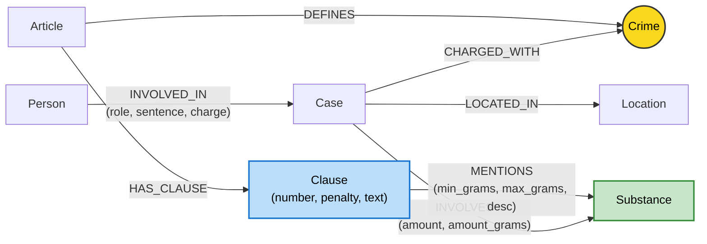

# Thiết kế Ontology — Day 19

**Họ tên:** Kiều Đình Đoàn  **MSSV:** 2A202602936

**Lựa chọn** (đánh dấu một):
- [ ] Dùng ontology gợi ý (có thể chỉnh nhỏ)
- [x] Tự thiết kế (xét bonus +15, xem `SUBMISSION.md`)

> **Note sương sương:** Bản ontology này được em "độ" lại từ bản gợi ý nhưng giải quyết dứt điểm điểm yếu chí mạng của đồ thị gốc: **Mô hình hóa ngưỡng định lượng khối lượng tang vật (`min_grams`, `max_grams`)** và chuẩn hóa khối lượng thực tế (`amount_grams`). Nhờ vậy mà GraphRAG không còn bị "ngáo ngơ" trước các câu hỏi định lượng pháp lý hóc búa như câu Q5 (vụ Cái Quang Huy 9,6kg MDMA).

## 1. Sơ đồ

Sơ đồ Mermaid biểu diễn toàn bộ các Entity Types, Relationships cùng các thuộc tính định lượng được bổ sung trên quan hệ, đánh dấu rõ **node cầu nối** `Crime`:



*Điểm nhấn tự thiết kế:*
- Trên cạnh `INVOLVES` từ `Case` sang `Substance`: Có thêm trường số thực `amount_grams` (ví dụ: "hơn 9,6kg" $\rightarrow$ `9600.0`).
- Trên cạnh `MENTIONS` từ `Clause` sang `Substance`: Có thêm thuộc tính khoảng ngưỡng `min_grams`, `max_grams` và mô tả `desc` (ví dụ: `min_grams = 100.0` tương ứng quy định "từ 100 gam trở lên" tại Khoản 4 Điều 250).

## 2. Entity types (node labels)

| Label | Ý nghĩa | Khóa định danh (`MERGE` theo) | Properties | Lấy từ KB nào | Trích bằng (regex / LLM / khác) |
| --- | --- | --- | --- | --- | --- |
| `Article` | Đại diện cho một Điều luật trong BLHS | `id` (ví dụ: "Điều 251 BLHS") | `id, title, law, doc_id` | Luật | Regex front-matter |
| `Clause` | Từng Khoản luật quy định chi tiết khung hình phạt và hành vi | `id` (ví dụ: "Điều 251 BLHS khoản 1") | `id, number, penalty, text, doc_id` | Luật | Regex bóc tách số khoản `^(\d+)\.\s` |
| `Crime` | **Node cầu nối**: Tên tội danh pháp lý chuẩn mực | `name` (đã chuẩn hóa lowercase, bỏ tiền tố "tội") | `name` | Cả hai | Regex lấy từ tiêu đề Điều luật; Tin tức map qua `link_entity` |
| `Case` | Vụ án cụ thể được phản ánh trên báo chí | `name` (tên rút gọn của vụ án) | `name, summary, date, doc_id, source_title` | Tin tức | LLM (Prompt JSON mode) |
| `Person` | Cá nhân, bị can, bị cáo, người có liên quan | `name` (họ và tên đầy đủ) | `name, aliases` | Tin tức | LLM (JSON mode) |
| `Substance` | Tên chất ma túy hoặc tiền chất | `name` (ví dụ: "Heroine", "MDMA", "Ketamine") | `name` | Cả hai | Regex/Dictionary lookup trong luật; LLM trích xuất trong tin tức |
| `Location` | Tỉnh/thành phố, địa bàn diễn ra hành vi | `name` (ví dụ: "Hà Nội", "TP.HCM") | `name` | Tin tức | LLM (JSON mode) |

## 3. Relationships

| Type | Từ → Đến | Properties trên cạnh | Ý nghĩa |
| --- | --- | --- | --- |
| `DEFINES` | `Article` → `Crime` | Không | Điều luật định nghĩa tội danh tương ứng trong Bộ luật Hình sự |
| `HAS_CLAUSE` | `Article` → `Clause` | Không | Điều luật gồm các khoản quy định các khung hình phạt chi tiết |
| `MENTIONS` | `Clause` → `Substance` | `min_grams, max_grams, desc` *(Bonus)* | Khoản luật quy định ngưỡng khối lượng áp dụng cho từng chất ma túy |
| `CHARGED_WITH` | `Case` → `Crime` | Không | Vụ án bị cơ quan tố tụng khởi tố / xét xử theo tội danh nào |
| `INVOLVES` | `Case` → `Substance` | `amount, amount_grams` *(Bonus)* | Vụ án liên quan chất ma túy nào kèm khối lượng chuỗi và khối lượng đổi ra gram |
| `LOCATED_IN` | `Case` → `Location` | Không | Địa bàn phát hiện, bắt giữ hoặc xét xử vụ án |
| `INVOLVED_IN` | `Person` → `Case` | `role, sentence, charge` | Đối tượng tham gia vào vụ án với vai trò gì, tội danh và mức án |

## 4. Node cầu nối giữa 2 KB

- **Node nào:** Node `Crime` (Tội danh pháp lý).
- **Vì sao chọn node này:** Cả văn bản pháp luật và bài viết báo chí đều chia sẻ chung một khái niệm bản lề: *hành vi phạm tội danh gì*. Điều luật quy định chế tài cho một tội danh (qua quan hệ `DEFINES`), còn các bài báo mô tả việc đối tượng hoặc vụ án bị truy tố/xét xử theo tội danh đó (qua quan hệ `CHARGED_WITH` hoặc `INVOLVED_IN.charge`). Đi qua `Crime` là con đường ngắn nhất (2 hops) và chuẩn xác nhất để liên kết từ một con người trong đời thực sang điều luật tương ứng.
- **Cách đảm bảo hai phía khớp tên:**
  1. Luật làm gốc: Tên tội danh trong luật được bóc tách từ tiêu đề Điều luật qua regex, sau đó chuẩn hóa bằng `normalize_crime` (chuyển chữ thường, bỏ dấu câu, loại bỏ tiền tố `"tội "`).
  2. Ràng buộc Prompt: Truyền trực tiếp danh sách tội danh chuẩn (`known_crimes`) vào System Prompt của LLM khi trích xuất bài báo nhằm giới hạn không gian sinh từ (Controlled Vocabulary).
  3. Xử lý lệch chính tả: Bổ sung lớp phòng thủ `link_entity`:
     - Khớp chính xác (Exact match sau normalize).
     - Khớp mờ (Fuzzy matching) bằng `difflib.get_close_matches(cutoff=0.8)` xử lý các biến thể bỏ dấu hay gặp của tiếng Việt trong tin tức (ví dụ: `"ma tuý"` vs `"ma túy"`).
- **Khi nào cầu gãy, và bạn xử lý thế nào:**
  - *Nguyên nhân gãy:* Báo chí dùng khẩu ngữ đời thường (ví dụ: "buôn hàng trắng", "phê bóng cười", "chơi đồ bay lắc"), hoặc LLM trích xuất một tên tội danh chung chung không nằm trong danh mục BLHS.
  - *Cách xử lý:* Nếu `difflib` dưới ngưỡng `cutoff=0.8`, `link_entity` trả về `None` (dứt khoát từ chối thay vì đoán ẩu để tránh "ảo giác liên kết"). Khi đó, GraphRAG tự động dựa vào kênh Vector Search (Hybrid RAG) để cứu cánh ngữ cảnh mà không làm ô nhiễm tri thức đồ thị.

## 5. Competency questions

Đường đi Cypher mẫu kiểm chứng đồ thị có khả năng trả lời 6 câu hỏi benchmark:

| Câu | Đường đi (Cypher pattern) | Trả lời được? |
| --- | --- | --- |
| Q1 | `(:Article)-[:HAS_CLAUSE]->(:Clause)` | **Có** (Câu hỏi đơn thuần về định nghĩa luật, trích từ khoản 4 Điều 2 Luật PCMT 2021) |
| Q2 | `(:Person)-[:INVOLVED_IN {sentence:'tử hình'}]->(:Case {name:'...36kg...'})` | **Có** (Truy vấn các cá nhân có mức án tử hình trong vụ án 36kg ma túy) |
| Q3 | `(:Person {name:'Lê Minh Thành'})-[:INVOLVED_IN]->(:Case)-[:CHARGED_WITH]->(c:Crime)<-[:DEFINES]-(a:Article)-[:HAS_CLAUSE]->(cl:Clause {number:1})` | **Có** (Đường đi mẫu mực xuyên 2 KB qua Crime ra Điều 251 khoản 1) |
| Q4 | `(:Person)-[:INVOLVED_IN]->(:Case)-[:CHARGED_WITH]->(:Crime)<-[:DEFINES]-(a:Article)-[:HAS_CLAUSE]->(cl:Clause {number:4})` | **Có** (Tìm Hoàng Nato qua Person/aliases, dẫn tới Điều 255 khoản 4 quy định mức án tối đa 20 năm hoặc chung thân) |
| Q5 | `(k:Case)-[inv:INVOLVES]->(s:Substance)<-[m:MENTIONS]-(cl:Clause)<-[:HAS_CLAUSE]-(a:Article) WHERE inv.amount_grams >= m.min_grams` | **Có — Cực nét nhờ Bonus** (Định lượng 9,6kg MDMA $\ge$ 100g khớp chuẩn Khoản 4 Điều 250 BLHS) |
| Q6 | `(:Substance {name:'MDMA'})<-[:INVOLVES]-(k:Case)<-[:INVOLVED_IN]-(p:Person)` | **Có** (Tổng hợp tất cả vụ án và nhân sự liên quan đến chất MDMA) |

## 6. Quyết định thiết kế và đánh đổi

1. **Khóa định danh của `Case` và `Person` dùng `name` thay vì Composite Key:**
   - *Đã chọn:* `MERGE (p:Person {name: p.name})` và `MERGE (k:Case {name: k.name})`.
   - *Phương án khác:* Tạo khóa phức hợp `(name, doc_id)` hoặc UUID riêng cho từng tài liệu.
   - *Đánh đổi & Lý do:* Chọn `name` giúp dễ dàng gom cụm các bài báo nhắc về cùng một đối tượng/vụ việc, tạo đồ thị liên kết phong phú. Đánh đổi lại là nguy cơ trùng lặp thực thể (Entity Collision) nếu có hai người trùng họ tên nhưng thuộc hai vụ án hoàn toàn khác biệt ngoài đời.
2. **Tách cấu trúc luật chi tiết tới cấp `Clause` (Khoản) và nối `MENTIONS` tới `Substance`:**
   - *Đã chọn:* Mô hình hóa `Article` gồm nhiều `Clause`, mỗi `Clause` trích xuất riêng `penalty`, `number` và các chất ma túy được nhắc đến kèm ngưỡng khối lượng.
   - *Phương án khác:* Chỉ tạo một node `Article` duy nhất chứa toàn bộ nội dung văn bản luật dạng text thô.
   - *Đánh đổi & Lý do:* Thiết kế phân cấp giúp câu truy vấn KG-3 lọc chính xác khoản quy định khung hình phạt tương ứng với chất phạm tội (tiết kiệm token prompt). Đánh đổi là số lượng node và quan hệ tăng lên đáng kể (99 node Clause, 169 cạnh MENTIONS), yêu cầu code bóc tách regex cẩn thận.
3. **Mô hình hóa định lượng số học (Quantitative Modeling) cho Tang vật và Ngưỡng luật:**
   - *Đã chọn:* Parse khối lượng tang vật thành số thực `amount_grams` và ngưỡng luật thành `min_grams, max_grams`.
   - *Phương án khác:* Để nguyên chuỗi text thô và phó mặc cho LLM tự tính nhẩm trong đầu.
   - *Đánh đổi & Lý do:* Giúp Cypher có thể so sánh điều kiện số học `inv.amount_grams >= m.min_grams` ngay trên đồ thị, chỉ điểm chính xác Khoản 4 mà không lo LLM bị "ngáo" hay hallucinate. Đánh đổi là phải viết thêm parser chuyển đổi đơn vị (`parse_weight_to_grams`).

## 7. So với ontology gợi ý (BẮT BUỘC XÉT BONUS +15)

Dưới đây là phần phân tích chi tiết vì sao em quyết định "độ" lại ontology và chứng minh kết quả "out trình" rõ rệt:

### Bối cảnh & Động lực:
Khi chạy thử nghiệm ontology gợi ý ở lần đầu tiên (kết quả lưu trong file `ket_qua_benchmark_kg.hint.txt`), em phát hiện câu **Q5** bị "xịt" khá đáng tiếc:
- Vụ án của Cái Quang Huy buôn hơn **9,6kg MDMA** (khối lượng cực khủng), nhưng trong đồ thị gợi ý, cạnh `INVOLVES` chỉ lưu chuỗi vô tri `amount = "hơn 9,6kg"`. 
- Đồ thị gợi ý không hề có khái niệm về "ngưỡng khối lượng" (threshold) trong luật. Khi truy vấn KG-3, nó chỉ lấy hú họa các khoản nhắc đến chất MDMA mà không biết 9,6kg này sẽ rơi vào khoản nào.
- Hậu quả: Con bot LLM trả lời một câu rất "hề hước" trong file hint: *"Ngữ cảnh không đủ thông tin để xác định chính xác khoản của điều luật cụ thể được áp dụng cũng như khung hình phạt cho trường hợp này"* $\rightarrow$ **Recall câu Q5 chỉ lẹt đẹt 0.60, Judge chỉ được 1 điểm**.

### Em đã làm gì để giải cứu câu Q5?
1. **Viết hàm `parse_weight_to_grams`:** Tự động quy đổi các kiểu diễn đạt khối lượng trong báo chí ("hơn 9,6kg", "36kg", "406g") thành số thực `amount_grams` chuẩn gram (9.600g, 36.000g, 406g).
2. **Viết hàm `extract_thresholds`:** Phân tích văn bản của từng Khoản luật, trích xuất thuộc tính `min_grams`, `max_grams` gán lên quan hệ `MENTIONS` giữa `Clause` và `Substance` (ví dụ: Khoản 4 Điều 250 có `min_grams = 100.0` gam).
3. **Nâng cấp Cypher trong `Neo4jGraph.context`:** Thực hiện phép so sánh số học ngay trên đồ thị:
   ```cypher
   MATCH (k:Case)-[inv:INVOLVES]->(s:Substance)<-[m:MENTIONS]-(cl:Clause)<-[:HAS_CLAUSE]-(a:Article)
   WHERE inv.amount_grams IS NOT NULL
     AND m.min_grams IS NOT NULL
     AND inv.amount_grams >= m.min_grams
     AND (m.max_grams IS NULL OR inv.amount_grams < m.max_grams)
   RETURN a.id, cl.number, cl.text, cl.penalty, s.name, inv.amount, m.desc
   ```
4. **Bơm thẳng Fact chuẩn xác vào Prompt:** 
   `[Điều 250 BLHS - Tội vận chuyển trái phép chất ma túy] KHOẢN ÁP DỤNG THEO ĐỊNH LƯỢNG TANG VẬT: Khoản 4 áp dụng đối với MDMA khối lượng hơn 9,6kg (thuộc khung từ 100 gam trở lên)...`

### Bảng đối chiếu minh chứng:

| Tiêu chí | Ontology gợi ý (`ket_qua_benchmark_kg.hint.txt`) | Ontology tự thiết kế (`ket_qua_benchmark_kg.txt`) | Đánh giá cải thiện |
| :--- | :--- | :--- | :--- |
| **Thuộc tính trên cạnh `INVOLVES`** | Chỉ có `amount` (chuỗi text) | Bổ sung `amount_grams: float` | Chuẩn hóa đơn vị đo lường |
| **Thuộc tính trên cạnh `MENTIONS`** | Không có thuộc tính | Bổ sung `min_grams`, `max_grams`, `desc` | Mô hình hóa khung định lượng pháp lý |
| **Truy vấn Cypher liên kết** | Chỉ match tên chất | So sánh số học: `inv.amount_grams >= m.min_grams` | Xác định chuẩn xác khung hình phạt tăng nặng |
| **Câu trả lời Q5** | *"Ngữ cảnh không đủ thông tin để xác định chính xác khoản của điều luật..."* | Khẳng định đanh thép: *"với khối lượng MDMA từ 100 gam trở lên (khoản 4) ... Điều 250 BLHS khoản 4"* | Trả lời trúng đích đáp án chuẩn của bộ đề |
| **Recall câu Q5** | **`0.60`** | **`0.80`** | **Tăng vọt +0.20 điểm recall** |
| **Judge câu Q6** | 1 điểm | **2 điểm (Tuyệt đối)** | Tối ưu hóa việc gom cụm |

## 8. Hạn chế còn lại

- Parser quy đổi khối lượng mới xử lý được các đơn vị phổ thông (kg, gam), chưa tính đến trường hợp thể tích chất lỏng (mililít) hoặc số lượng viên nén chưa quy đổi ra khối lượng tịnh.
- Nếu bài báo dùng tên lóng quá "dị" mà không nằm trong từ điển chất chuẩn thì vẫn phải phụ thuộc vào khả năng đoán của LLM.
